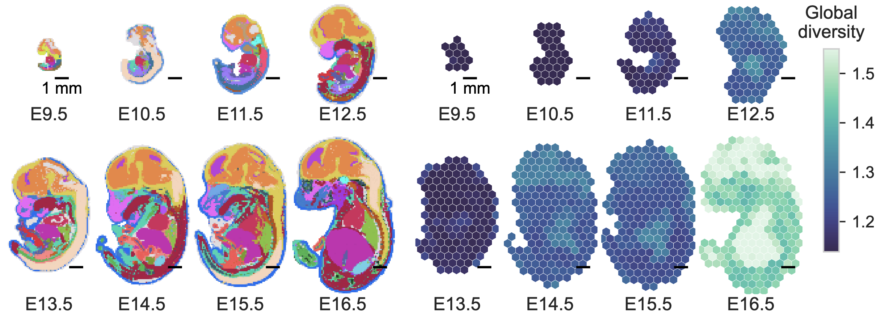

---

##### Download

+ [You can find the paper here.](https://www.biorxiv.org/content/10.64898/2026.07.13.735796v1)
<!-- + [Online appendix](appendix2.pdf)
+ [Code and data](https://github.com/pmichaillat/unemployment-gap) -->

---

##### Abstract

Downstream analysis in single-cell and spatial transcriptomics is highly dependent on a sequence of upstream modeling choices. The non-canonicity of these choices presents challenges for reproducibility. In particular, measures of cellular heterogeneity and diversity do not solely reflect biological variation, but are also sensitive to parameter settings. A diversity measure that is robust to modeling choices, such as clustering resolution, is therefore desirable to improve reproducibility and interpretability. Here, we introduce scDIV, a similarity-sensitive measure of cellular diversity inspired by mathematical ideas in ecological science, which is robust to graph-based clustering parameters and remains applicable even in the absence of cell-type clusters. We use scDIV to quantitatively track the progress of tissue differentiation in both single-cell and spatial mouse development datasets and to evaluate different engineered stem-cell-based embryo models. In contrast to traditional entropy-based methods, such as the Hill number, used to quantify biodiversity, scDIV remains robust to clustering.

---

##### scDIV method overview


<!-- 
---
##### Related material

+ [Presentation slides](presentation1.pdf)
+ [QuiverZLive](https://github.com/jazzooi21/QuiverZLive) is an interactive tool for calculation and manipulation of quivers in 3d N=4 supersymmetric quantum field theories.

##### Citation

Unterholzer, Detlev A., and  Moritz-Maria von Igelfeld. 2013. "Unusual Uses For Olive Oil." *Journal of Oleic Science* 34 (1): 449–489. http://www.alexandermccallsmith.com/book/unusual-uses-for-olive-oil.

```BibTeX
@article{UI13,
author = {Detlev A. Unterholzer and Moritz-Maria von Igelfeld},
year = {2013},
title ={Unusual Uses For Olive Oil},
journal = {Journal of Oleic Science},
volume = {34},
number = {1},
pages = {449--489},
url = {http://www.alexandermccallsmith.com/book/unusual-uses-for-olive-oil}}
```

---

##### Related material

+ [Presentation slides](presentation1.pdf)
+ [Summary of the paper](https://www.penguinrandomhouse.com/books/110403/unusual-uses-for-olive-oil-by-alexander-mccall-smith/)
   -->
